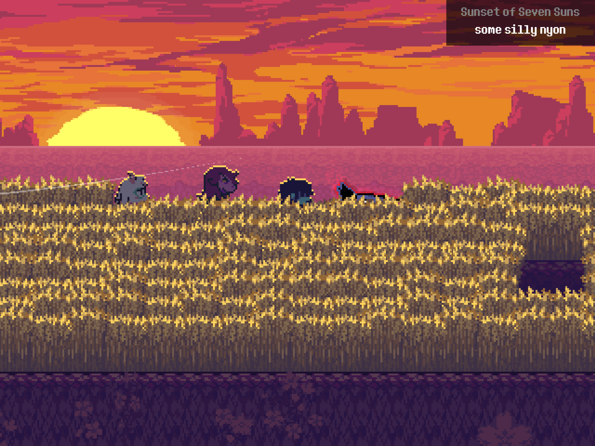
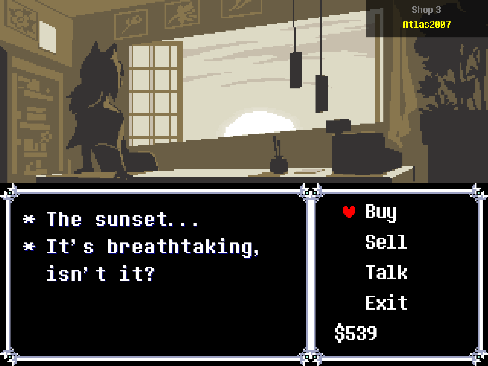

<h1 align="center">DELTANYON</h1>

<i>Nyon! nyon! ueueleuleuleuleue</i>

  

The culmination of a full month of work from a talented niche of the *DELTARUNE* fanbase, **DELTANYON** is a full soundtrack replacement for [Toby Fox's magnum opus](https://deltarune.com). This mod replaces every track in the OST (and many unlisted tracks) with community-made covers featuring the greatest bird of all time.

**Please see [CREDITS.md](https://github.com/MSLaFaver/DELTANYON/blob/main/CREDITS.md) for the full list of Kawkaw covers and creators!** The mod also features toasts in the upper right corner with the OST title and the cover creator when you hear a new track. See below for examples!

	

	

Each and every creator, along with their YouTube channel and individual video links, are provided in **[CREDITS.md](https://github.com/MSLaFaver/DELTANYON/blob/main/CREDITS.md)**. You can also view [`nyon.json`](https://github.com/MSLaFaver/DELTANYON/blob/main/Mod/Deploy/nyon.json) to check the mapping for each specific file. We've attempted to give as much credit as possible in this project to be appropriately transformative. If you are a creator whose cover was used in this mod and do not wish to remain included, please [open a GitHub issue](https://github.com/MSLaFaver/DELTANYON/issues/new) or send an email to [michael@returntogilead.com](mailto:michael@returntogilead.com).

## Installation Instructions
1. Download the latest version of the *UndertaleModCli* (`UTMT_CLI_v*-Windows.zip`) from https://github.com/UnderminersTeam/UndertaleModTool/releases/latest.
2. Right-click on the `.zip` file and select `Extract All...`. Select `Extract` or choose a different folder.
3. Download the latest version of the *DELTANYON* source code from https://github.com/MSLaFaver/DELTANYON/archive/refs/heads/main.zip.
4. Extract this `.zip` file the same way as the last.
5. View the extracted files and navigate to the `Installer` folder.
6. Right-click in the `Installer` folder and select `Open in Terminal`.
7. Type in `powershell .\Install-Mods.ps1` and press enter.
8. The script will try to detect your installation of *DELTARUNE*. Enter `Y` to use the Steam default install location. If it fails, you will need to find `DELTARUNE.exe` and supply it to a file picker.
9. The script will then ask for the location of *UndertaleModCli*. Navigate to the folder you extracted in Step 2.
10. Done! The installer will create backups of your *DELTARUNE* game files and install *DELTANYON*.

### How to uninstall
If you want to revert to a vanilla *DELTARUNE* installation, you can either choose to delete your install folder or use Steam to uninstall the game, or you can:
1. Navigate to your *DELTARUNE* install directory (*DELTARUNE in Steam Library -> Settings -> Manage -> Browse local files*).
2. Copy the `data.win` file from each `backup` folder to its parent folder, replacing the existing `data.win` file.
   * **NOTE: There are 6 different `data.win` files.** Make sure you only restore each file to its correct location. Do not mix and match.
   *  *Optional: Delete the `nyons` folder and `nyon.json`.*
3. Done! Run *DELTARUNE* as normal to confirm the uninstallation.

## Reporting Issues
Missing a track? Issues with installing? Found a bug? Annoyed at me personally? [Check the issues list](https://github.com/MSLaFaver/DELTANYON/issues) and consider opening one!

No, shooing Kawkaw is not a bug. I don't know why you would ask that.

Special thanks to **Stellarsweets (aka Nyon Compiler)** for starting this project and serving as an invaluable member to the Kawkaw cover lover community.

  

